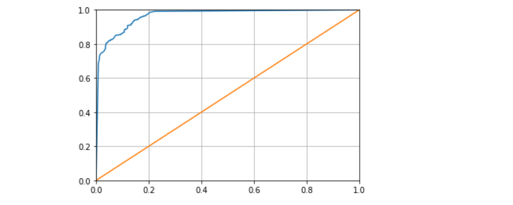

# Automatic Machine Learning Prototype

This is the first introduction into Automation for the Prototype phase of machine learning. I need to note that this is not a final product is more of a first introduction into automation - Originally developed 20/01/2020

## What was developed in this project

1. Different Dataset Cleaning techniques
2. How to test different models 
3. Search for the best Hyperparameters
4. Evaluate the model with different metrics

